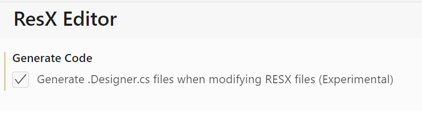

[](https://marketplace.visualstudio.com/items?itemName=TimHeuer.resx-editor)

# RESX Editor

This is a previewer/light-weight editor for string-based RESX/RESW files commonly used for localization for .NET applications. As with most of my projects this started as a learning experiment and thus is not feature rich. But it is MIT licensed, so please, by all means contribute!

## Features

Pretty simple really, if you open a .resx/.resw file from your workspace, you have the option of using this by default for the viewer and it will show the contents in a data grid format:


### Edit a resource

To edit, simple click in a cell and start typing.  This will 'dirty' the file and you'll have to save (doesn't auto-persist).

### Add a new resource

To add a new resource, open the resx file you want to add it to and launch the command pallette (CTRL + SHIFT + P).  Choose `ResX: Add new resource` which will launch a flow to ask you for the Key, Value, and Comment (all required) and then add it to the active document.


### Delete a resource

From an open resx file, right-click on the resource you want to delete and choose `Delete resource` from the context menu.


### Code Generation (Experimental)

Starting in `v0.2.32` there is an option to enable code generation. Because this extension does not actually use he resgen tool itself, it is basically a file rewrite (which the tool does also FWIW). The extension has attempted to preserve the format that VS generates to minimize diffs, including the giant unnecessary comment at the top of every resx and .Designer.cs file. To enable this check the option in the extension settings:



or manually set in your settings file:

```json copy
"resx-editor.generateCode": true
```

Feedback welcome on this area via issues and contributions to improve. It for sure will not work for everyone.

### Logging

In the settings you can enable 'verbose' logging which will create an output window category and you can see some details.  Helpful for troubleshooting.


### A note on editing

Right now this is a bulk edit -- meaning it will re-serialize the data in/out of JSON/RESX format for this editor.  Tracking issue [#1](https://github.com/timheuer/resx-editor/issues/1) for improvements here, but as of now 'works on my machine' applies.  The serialization also probably will not match your line endings/spacing so a first diff might be more red/green than expected.  If that doesn't work, help fix or just probably not use this.

### VS Code Git diff viewing

Because this is a custom editor, if it is set as default, when viewing a diff it will render both editor views and you won't be able to see the actual diff.  You'll want to switch to the Text Editor to see it.  This is a known limitation of the VS Code custom editor extensbility points [microsoft/vscode#138525](https://github.com/microsoft/vscode/issues/138525) right now.  Maybe there is a better way of doing this even in this mode, if you can think of one, please contribute to [#3](https://github.com/timheuer/resx-editor/issues/3).  

### Disabling the editor

To disable this right click on a `resx` or `resw` file and choose `Open with...` and change options:


## Credit

This is not an original idea of course.  ResX/ResW/XML editors exist.  None of them use the VS Code WebView UI toolkit and why I did this one.  Again, selfish reasons, and a learning point.  There are a few others out there that are similar and inspiration was absolutely from those.  Also the editing was contributed by @worksofliam as we wait to see if the `vscode-data-grid` itself can get default edibility.
